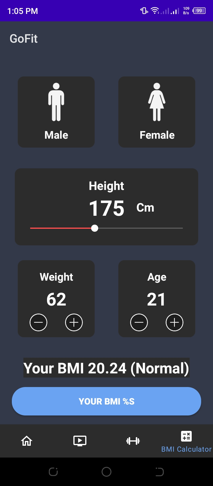

# GoFit

## Overview

This GoFit fitness app is made to assist users in keeping track of their physical activity and other sorts of physical training. This application's objective is to gather information about users' fitness-related activities. Additionally, the user can utilize the BMI calculator on this app to determine their body mass index as well as measure the calories they burn during each exercise.

## Requirements
*   Android Studio 4.0 (installed on a Mac, Linux, or Windows machine)
*   Android device in [developer mode](https://developer.android.com/studio/debug/dev-options) with USB debugging enabled
*   USB cable (to connect Android device to your computer)

## Features

### Home

The Gofit homepage is the first screen that the user sees after signing up and login in. The user can see his name, the date, the temperature, total duration of user workout, and total calories burned. Additionally, the user may view his workout history as well as the duration and calories burned of that exercise and at the bottom, a menu navigation bar is shown that user can click and launch it.

### Learn Workout

This is the learn workout interface that appears when the user clicks the second icon in the menu bar at the bottom. Here, the user may see buttons with exercise names and a video screen; when the user selects a button, the video for that exercise will play so they can learn how to perform it.

### Add Workout

The user will see a list of workouts here when he hits the third icon in the menu bar at the bottom. This is the interface where he can add workouts. When the user has decided which exercise to perform, he can push the Start button.

### BMI Calculator

The BMI Calculator is the last icon in the menu bar at the bottom, where the user can determine his BMI. Here the user chooses whether he is male or female and enters his height in centimeters, his weight in kilograms, and age. The results of the user's BMI will appear when he hits the Your BMI button, letting him know if he is underweight, normal weight, overweight, or obese.

